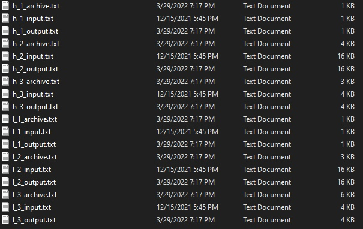

**Архивариус**  
Данный проект позволяет архивировать различные тексты с помощью 2-х алгоритмов кодирования информации:

- Алгоритм Хаффмана
- Алгоритм LZW (Лемпела-Зива-Велча)

В ходе разработки данных алгоритмов было обнаружено, что данные алгоритмы более эффективны на больших объемах данных.
Также мы выяснили, что код Хаффмена имеют один существенный недостаток по сравнению с кодом LZW - он никак не учитывает
взаимосвязей между символами, которые присутствуют практически в любом тексте. С другой стороны если в тексте нет
взаимосвязи между символами LZW будет неэффективен в таком случае. Еще пара слов об LZW: он может работать только с теми
текстами, которые содержат только ASCII символы из основной таблицы.

Ниже представлена статистика по работе с различными данными, где дерево Хаффмана добавлено:

